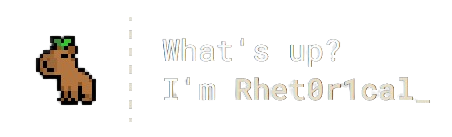

> **https://rhet0rical.dev**

I'm **Keegan**, but you know me as **Rhet0r1cal_**. I'm **16** years of age, and have sold my soul to the world of computers never to return. I've been using computers for about **7 years**, and have been coding stuff since **early 2017**. My main skill is **Web Development**, and i've been focusing on that since early 2020.

Starting on platforms such as Scratch, I made around 50+ things, before simply deciding that letters and numbers could do so much more then blocks and legos. Ever since that point, i've been using my **keyboard as if it were a sport**, have somehow accumulated a **WPM of 100+**, and have even starting **building computers**.
